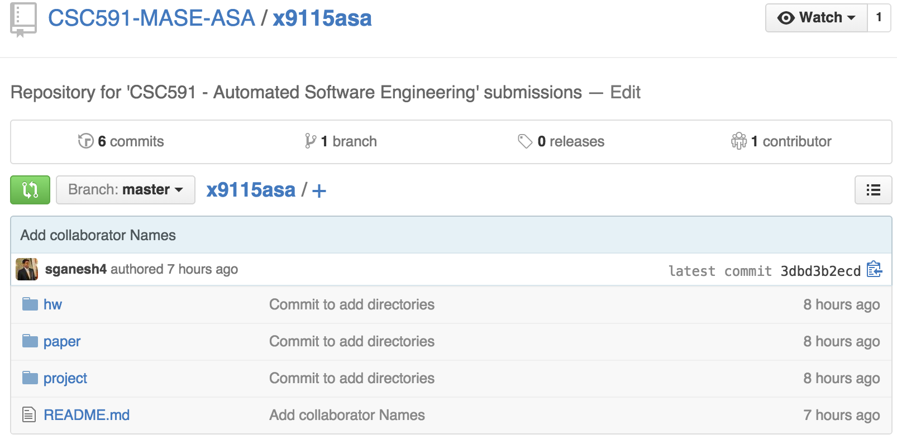
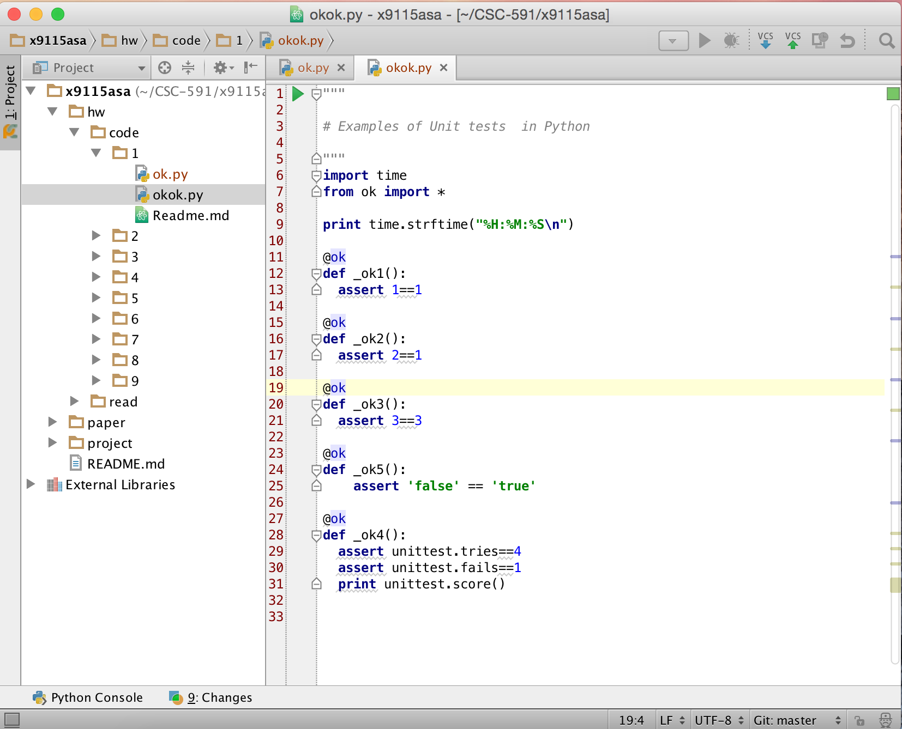
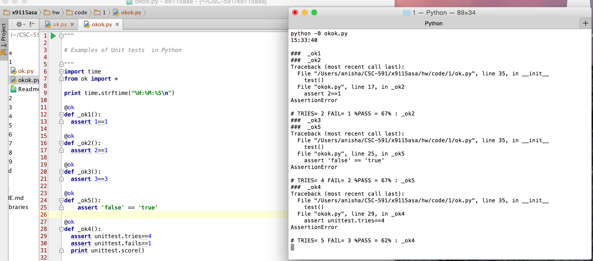

## CSC-591 x9115asa HW 1

### Screen snap of the top level of our repo



### Output of commands
- python --version

```unix
Anishas-MacBook-Pro:1 anisha$ python --version
Python 2.7.6
```

- pip help

```unix
Anishas-MacBook-Pro:1 anisha$ pip help

Usage:
  pip <command> [options]

Commands:
  install                     Install packages.
  uninstall                   Uninstall packages.
  freeze                      Output installed packages in requirements format.
  list                        List installed packages.
  show                        Show information about installed packages.
  search                      Search PyPI for packages.
  wheel                       Build wheels from your requirements.
  help                        Show help for commands.

General Options:
  -h, --help                  Show help.
  --isolated                  Run pip in an isolated mode, ignoring environment variables and user configuration.
  -v, --verbose               Give more output. Option is additive, and can be used up to 3 times.
  -V, --version               Show version and exit.
  -q, --quiet                 Give less output.
  --log <path>                Path to a verbose appending log.
  --proxy <proxy>             Specify a proxy in the form [user:passwd@]proxy.server:port.
  --retries <retries>         Maximum number of retries each connection should attempt (default 5 times).
  --timeout <sec>             Set the socket timeout (default 15 seconds).
  --exists-action <action>    Default action when a path already exists: (s)witch, (i)gnore, (w)ipe, (b)ackup.
  --trusted-host <hostname>   Mark this host as trusted, even though it does not have valid or any HTTPS.
  --cert <path>               Path to alternate CA bundle.
  --client-cert <path>        Path to SSL client certificate, a single file containing the private key and the
                              certificate in PEM format.
  --cache-dir <dir>           Store the cache data in <dir>.
  --no-cache-dir              Disable the cache.
  --disable-pip-version-check
                              Don't periodically check PyPI to determine whether a new version of pip is available
                              for download. Implied with --no-index.
```

- easy_install -h

```unix
Anishas-MacBook-Pro:1 anisha$ easy_install -h

Global options:
  --verbose (-v)  run verbosely (default)
  --quiet (-q)    run quietly (turns verbosity off)
  --dry-run (-n)  don't actually do anything
  --help (-h)     show detailed help message
  --no-user-cfg   ignore pydistutils.cfg in your home directory

Options for 'easy_install' command:
  --prefix                   installation prefix
  --zip-ok (-z)              install package as a zipfile
  --multi-version (-m)       make apps have to require() a version
  --upgrade (-U)             force upgrade (searches PyPI for latest versions)
  --install-dir (-d)         install package to DIR
  --script-dir (-s)          install scripts to DIR
  --exclude-scripts (-x)     Don't install scripts
  --always-copy (-a)         Copy all needed packages to install dir
  --index-url (-i)           base URL of Python Package Index
  --find-links (-f)          additional URL(s) to search for packages
  --build-directory (-b)     download/extract/build in DIR; keep the results
  --optimize (-O)            also compile with optimization: -O1 for "python -
                             O", -O2 for "python -OO", and -O0 to disable
                             [default: -O0]
  --record                   filename in which to record list of installed
                             files
  --always-unzip (-Z)        don't install as a zipfile, no matter what
  --site-dirs (-S)           list of directories where .pth files work
  --editable (-e)            Install specified packages in editable form
  --no-deps (-N)             don't install dependencies
  --allow-hosts (-H)         pattern(s) that hostnames must match
  --local-snapshots-ok (-l)  allow building eggs from local checkouts
  --version                  print version information and exit
  --no-find-links            Don't load find-links defined in packages being
                             installed
  --user                     install in user site-package
                             '/Users/anisha/Library/Python/2.7/lib/python/site
                             -packages'

usage: easy_install [options] requirement_or_url ...
   or: easy_install --help

```

### Code in Python IDE
We have used the IDE [PyCharm](https://www.jetbrains.com/pycharm/)
Below is a screenshot of the code in the IDE


### okok.py output

