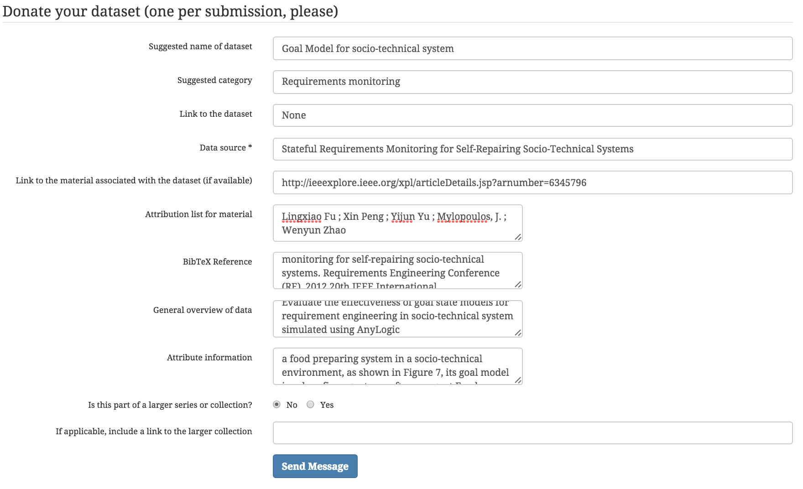

| Fileds   |      Values     
|----------|:-------------:|
| Suggested name of dataset |  Goal Model for socio-technical system |
| Suggested category |    Requirements monitoring   |
| Link to the dataset | None |
| Data source | Stateful Requirements Monitoring for Self-Repairing Socio-Technical Systems |
| Link to the material associated with the dataset (if available) | http://ieeexplore.ieee.org/xpl/articleDetails.jsp?arnumber=6345796 |
| Attribution list for material | Lingxiao Fu ; Xin Peng ; Yijun Yu ; Mylopoulos, J. ; Wenyun Zhao |
| BibTeX Reference | Lingxiao Fu, Xin Peng, Yijun Yu, John Mylopoulos, Wenyun Zhao. 2012. Stateful requirements monitoring for self-repairing socio-technical systems. Requirements Engineering Conference (RE), 2012 20th IEEE International. |
| General overview of data | Evaluate the effectiveness of goal state models for requirement engineering in socio-technical system simulated using AnyLogic |
| Attribute information | The data set describes a food preparing system in a socio-technical environment. Its goal model involves five agents: a software agent Food Ordering System, and four human agents: Customer, Order Dispatcher, Chef, and Delivery Man. |

**Form screenshot**

