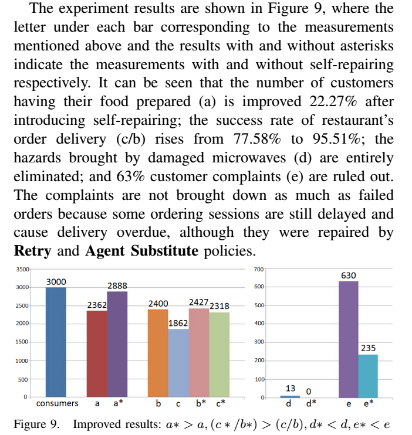

### Reference
Lingxiao Fu, Xin Peng, Yijun Yu, John Mylopoulos, Wenyun Zhao. 2012. Stateful requirements monitoring for self-repairing socio-technical systems. Requirements Engineering Conference (RE), 2012 20th IEEE International.

### Keywords
**ii1 self-repair**

Self-repair refers to the ability of the systems to restore fulfillment of their requirements by relying on monitoring, reasoning, and diagnosing on the current state of individual requirements.

**ii2 requirements monitoring**

Maintaining the state of each requirement of the system and checking if the system is correctly fulfilling the requirement during runtime.

**ii3 goal models**

Refers to a model-based approrach of visualising goals in order to support monitoring and repairing of the proposed stateful goals (end state of the system).

**ii4 Socio-technical systems**

It is a term used to refer to systems that consist of human, hardware and software components that work together in order to fulfill requirements of the system.

### Feature Extraction
**iii1 Related Work**

1. M. Feather, S. Fickas, A. van Lamsweerde, and C. Ponsard, “Reconciling system requirements and runtime behavior”, in IWSSD, 1998.
proposes runtime requirements monitoring and repairing based on goal-oriented requirements engineering.

2. Below papers discuss runtime error detection and repair.

  i. Y.Wang,S.A.Mcllraith,Y.Yu,andJ.Mylopoulos,“Anauto- mated approach to monitoring and diagnosing requirements”, in ASE, 2007.

  ii. Y. Wang and J. Mylopoulos, “Self-repair through reconfigu- ration: A requirements engineering approach”, in ASE. IEEE Computer Society, 2009, pp. 257–268.

3. Below papers discuss a centralized approach for requirement monitoring and self repair.

  i. Y. Wang and J. Mylopoulos, “Self-repair through reconfigu- ration: A requirements engineering approach”, in ASE. IEEE Computer Society, 2009, pp. 257–268.

  ii. F. Dalpiaz, P. Giorgini, and J. Mylopoulos, “An architec- ture for requirements-driven self-reconfiguration”, in CAiSE, 2009.

4. Y. L. Traon, B. Baudry, and J.-M. Je ́ze ́quel, “Design by contract to improve software vigilance”, IEEE Trans. Softw. Eng., vol. 32, pp. 571–586, 2006. discusses another runtime requirement verification framework called MOP.

**iii2 Baseline Results**

The authors have provided a detailed explanation of the results derived from the experimental study performed to evaluate the hypothesis. The results of this experiment can be used as a baseline for future research in this area.

**iii3 Sample model**

The current hypothesis is studied by implementing it in the form of a Java framework . A food preparing system in a socio-technical environment is chosen to evaluate the hypothesis. It is simulated suing AnyLogic, containing Java APIs to measure the effectiveness through several key performance indicators.

**iii4 Future work**

Towards the end of the paper , the authors point out that the effectiveness of their current hypothesis and propose the integration of the current work with the runtime modeling of the behaviors of physical world domains. They also mention that there is scope for more experiments with the socio-technical systems in the real world.

### Improvement possibilities

**iv1 Provide Delivery tools** :

Providing delivery tools that would enable other researchers to rerun the analysis could help the readers of the paper gain a better understanding of the system studied.

**iv2 Tutorial materials** :

Since the area of runtime requirement-monitoring and self repairing system is fairly new, tutorial materials could help researchers and students in the field gain a better understanding of the concept and the available material on the subject.

**iv3 Patterns and Anti-Patterns** :

The authors have provided a detailed explanation about the implementation,simulation and results of the experiments. However, since socio technical systems are dynamic and have a large number of variables that can affect the result of a simulation, a list of patterns and anti-patterns to be mindful of could help future research avoid the mistakes/obstacles that the authors of the current paper faced.

### Connection to previous paper
This paper is a step further from the concept introduced in Paper 1. While paper 1 also discusses runtime requirement-monitoring , this paper also factors in the socio-technical parameters that affect the requirement satisfaction of a system. It provides a more concrete explanation to the idea introduced in paper 1.
